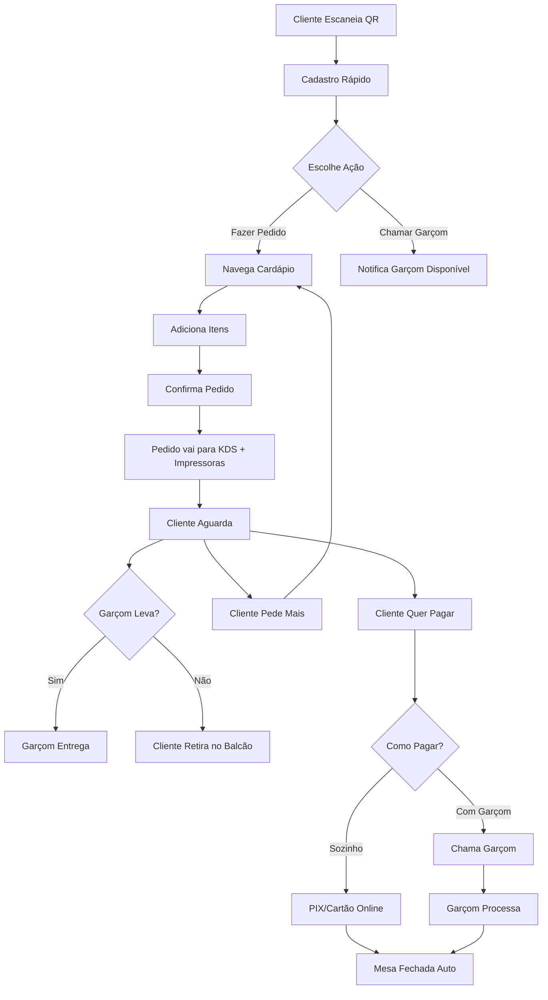
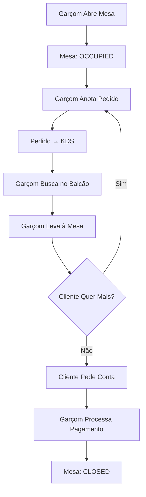
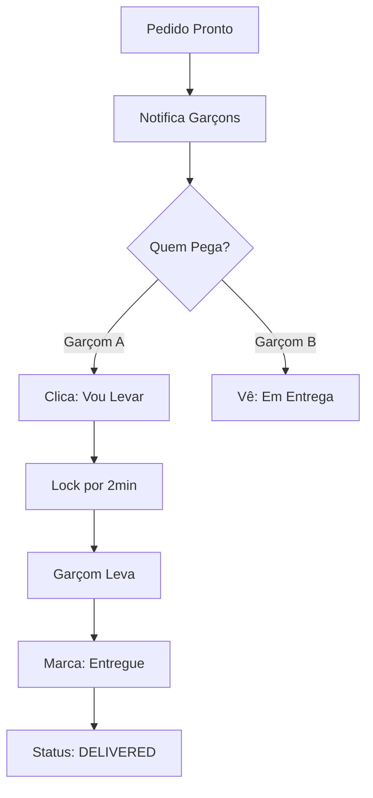

# Sistema de Comanda Virtual Self-Service - Documentação Completa

> **Documentação Técnica Unificada**  
> Sistema revolucionário de atendimento digital para restaurantes e bares

**Versão:** 2.0  
**Data:** 29/12/2024  
**Status:** Em Desenvolvimento (70% Concluído)

---

## 📋 Índice

1. [Visão Geral](#visão-geral)
2. [Funcionalidades Principais](#funcionalidades-principais)
3. [Arquitetura Técnica](#arquitetura-técnica)
4. [Modelos Operacionais](#modelos-operacionais)
5. [Configurações Avançadas](#configurações-avançadas)
6. [Sistema de Rastreabilidade](#sistema-de-rastreabilidade)
7. [Fluxos Detalhados](#fluxos-detalhados)
8. [Edge Cases e Soluções](#edge-cases-e-soluções)
9. [Componentes e APIs](#componentes-e-apis)
10. [Progresso da Implementação](#progresso-da-implementação)
11. [Roadmap e Próximos Passos](#roadmap-e-próximos-passos)

---

## 🎯 Visão Geral

### Problema Resolvido

**Restaurantes e bares enfrentam:**
- ❌ Atendimento lento (cliente espera garçom)
- ❌ Erros de anotação de pedidos
- ❌ Falta de rastreabilidade (quem fez o quê)
- ❌ Perdas financeiras não controladas
- ❌ Sistemas inflexíveis (um modelo para todos)
- ❌ Falta de transparência na taxa de serviço

### Solução SUMMO

**Sistema híbrido inteligente:**
- ✅ Cliente pode pedir sozinho (QR Code)
- ✅ OU chamar garçom quando precisar
- ✅ Rastreabilidade 100% de todas as ações
- ✅ Controle total de perdas e prejuízos
- ✅ Configuração flexível por estabelecimento
- ✅ Taxa de serviço totalmente configurável
- ✅ Gamificação opcional para garçons
- ✅ Integração com KDS e impressoras

---

## 🚀 Funcionalidades Principais

### Para Clientes

#### 1. QR Code na Mesa
- Cada mesa possui QR Code único
- Escaneia e acessa instantaneamente
- Cadastro rápido (nome + telefone)
- Retoma sessão se voltar

#### 2. Pedidos Self-Service
- Cardápio digital categorizado
- Adiciona itens ao carrinho
- Pedidos incrementais (pode pedir mais)
- Ver total acumulado em tempo real

#### 3. Chamar Garçom
- Botão "Chamar Garçom" sempre visível
- Sistema encontra garçom disponível
- Tipos: Assistência, Dúvida, Conta

#### 4. Pagamento Flexível
- **Digital:** PIX ou Cartão online
- **Garçom:** Chama para pagar em dinheiro/cartão físico
- Divisão de conta (4 métodos)

### Para Garçons

#### 1. Dashboard Inteligente
- Pedidos pendentes em tempo real
- Solicitações de clientes
- Mesas ativas
- Ranking de desempenho

#### 2. Sistema de Coleta (Opcional)
- Pedidos aparecem para todos
- Primeiro que clicar pega
- Ganha pontos por velocidade
- Entrega colaborativa

#### 3. Gestão de Entregas
- Lista clara do que levar
- Bebidas priorizadas
- Marca itens como entregues
- Tracking completo

#### 4. Controle de Disponibilidade
- Status: Disponível / Ocupado / Offline
- Mesas ativas rastreadas
- Sistema atribui automaticamente

### Para Gerentes

#### 1. Configuração Total
- 8 categorias de configuração
- Modelos prontos (Tradicional/Casual/Híbrido)
- Taxa de serviço configurável
- Horários de pico

#### 2. Dashboard de Perdas
- Rastreabilidade completa
- Controle de prejuízos
- Aprovação de perdas
- Blacklist de clientes

#### 3. Relatórios e Analytics
- Perdas por tipo
- Performance por garçom
- Horários de pico
- Tendências

---

## 🏗️ Arquitetura Técnica

### Estrutura de Arquivos

```
src/features/virtual-tab/
├── types/
│   ├── tableSession.ts          # Sessão da mesa
│   ├── orderClaim.ts             # Coleta de pedidos
│   ├── waiterStatus.ts           # Status de garçons
│   ├── lossTracking.ts           # Rastreamento de perdas
│   ├── operationSettings.ts      # Configurações básicas
│   ├── advancedConfig.ts         # Configurações avançadas
│   └── index.ts
├── hooks/
│   ├── useTableSession.ts        # Gerencia sessão
│   ├── useOrderClaim.ts          # Sistema de coleta
│   ├── useWaiterRequest.ts       # Solicitações
│   ├── useWaiterStatus.ts        # Disponibilidade
│   └── useLossTracking.ts        # Controle de perdas
├── components/
│   ├── QuickRegistration.tsx     # Cadastro rápido
│   ├── QRCodeGenerator.tsx       # Gera QR Codes
│   ├── CallWaiterButton.tsx      # Botão chamar garçom
│   ├── PaymentOptions.tsx        # Opções de pagamento
│   ├── WaiterOrderAlert.tsx      # Alerta de pedido
│   ├── OrderClaimCard.tsx        # Card de pedido coletado
│   ├── LossDashboard.tsx         # Dashboard de perdas
│   └── OperationSettingsForm.tsx # Configurações
├── pages/
│   ├── TableSessionPage.tsx      # Página do cliente
│   └── WaiterDashboard.tsx       # Dashboard do garçom
├── utils/
│   └── claimUtils.ts             # Utilitários
└── index.ts
```

### Collections Firestore

#### `tableSessions`
```typescript
{
  id: string;
  tenantId: string;
  tableId: string;
  tableNumber: string;
  
  // Cliente
  customerName: string;
  customerPhone: string;
  
  // Origem
  openedBy: 'CUSTOMER' | 'WAITER';
  openedByUserId: string;
  assignedWaiterId?: string;
  
  // Status
  status: 'ACTIVE' | 'BILL_REQUESTED' | 'PAYING' | 'CLOSED';
  
  // Pedidos
  orderIds: string[];
  totalAmount: number;
  
  // Pagamento
  paymentFlow?: 'SELF_SERVICE_DIGITAL' | 'SELF_SERVICE_WAITER' | 'WAITER_INITIATED';
  paymentStatus?: 'PENDING' | 'PROCESSING' | 'COMPLETED';
  
  // Solicitações
  waiterRequests: WaiterRequest[];
  
  // Timestamps
  openedAt: Date;
  lastActivityAt: Date;
}
```

#### `waiterStatus`
```typescript
{
  id: string;                     // waiterId
  tenantId: string;
  name: string;
  
  // Disponibilidade
  availability: 'AVAILABLE' | 'BUSY' | 'OFFLINE';
  activeTables: string[];         // Mesas abertas
  
  // Estatísticas
  today: {
    tablesOpened: number;
    ordersDelivered: number;
    totalPoints: number;
    rank: number;
  };
  
  lastActivity: Date;
}
```

#### `lossIncidents`
```typescript
{
  id: string;
  tenantId: string;
  type: 'WALKOUT' | 'CANCELLED_ORDER' | 'KITCHEN_ERROR' | ...;
  amount: number;                 // Valor perdido
  cost: number;                   // Custo real
  
  // Rastreabilidade
  tracking: {
    openedBy: string;
    openedByName: string;
    attendedBy: string;
    deliveredBy: string[];
  };
  
  // Detalhes
  details: {
    customerName: string;
    customerPhone: string;
    description: string;
    reportedBy: string;
    approved: boolean;
  };
  
  status: 'PENDING' | 'APPROVED' | 'REJECTED';
}
```

#### `restaurantConfig`
```typescript
{
  tenantId: string;
  
  // Taxa de Serviço
  serviceCharge: {
    enabled: boolean;
    percentage: number;
    distribution: 'INDIVIDUAL' | 'POOL' | 'HOUSE' | 'MIXED';
    rules: { ... };
  };
  
  // Horários de Pico
  peakHours: {
    enabled: boolean;
    periods: [ ... ];
  };
  
  // Gestão de Mesas
  tableManagement: { ... };
  
  // E muito mais...
}
```

---

## 🔧 Modelos Operacionais

### 1. 🍽️ Tradicional (Com Taxa de Serviço)

**Quando usar:**
- Restaurantes que pagam taxa aos garçons
- Atendimento personalizado
- Garçom responsável do início ao fim

**Características:**
```typescript
{
  serviceModel: 'DEDICATED',
  serviceCharge: {
    enabled: true,
    percentage: 10,
    distribution: 'INDIVIDUAL',
  },
  allowSelfService: false,
  delivery: {
    waiterDelivery: {
      responsibleWaiterOnly: true,
      allowCollaborative: false,
    },
  },
}
```

**Fluxo:**
```
Cliente senta → Garçom atende → Garçom anota → 
Garçom busca → Garçom leva → Garçom cobra → 
Taxa de 10% vai para o garçom
```

---

### 2. 🍺 Casual (Sem Taxa de Serviço)

**Quando usar:**
- Bares, espetinhos, lanchonetes
- Atendimento rápido e colaborativo
- Sem taxa de serviço

**Características:**
```typescript
{
  serviceModel: 'COLLABORATIVE',
  serviceCharge: {
    enabled: false,
  },
  allowSelfService: true,
  delivery: {
    waiterDelivery: {
      allowCollaborative: true,
    },
    pickupCounter: {
      enabled: true,
    },
  },
}
```

**Fluxo:**
```
Cliente escaneia QR → Faz pedido → KDS → 
Qualquer garçom leva → Cliente paga sozinho (PIX)
```

---

### 3. ⚡ Híbrido (Flexível)

**Quando usar:**
- Estabelecimentos modernos
- Máxima flexibilidade
- Taxa apenas se garçom atendeu

**Características:**
```typescript
{
  serviceModel: 'HYBRID',
  serviceCharge: {
    enabled: true,
    percentage: 10,
    rules: {
      chargeOnWaiterService: true,
      chargeOnSelfService: false,  // SEM taxa em self-service
    },
  },
  allowSelfService: true,
  delivery: {
    waiterDelivery: {
      allowCollaborative: true,
    },
  },
}
```

**Fluxo A (Com Garçom):**
```
Garçom atende → Anota → Leva → Cobra → Taxa de 10%
```

**Fluxo B (Self-Service):**
```
Cliente pede sozinho → Garçom leva → Paga via PIX → SEM taxa
```

---

## ⚙️ Configurações Avançadas

### 1. 💰 Taxa de Serviço

#### Distribuição
```typescript
{
  distribution: {
    model: 'MIXED',
    split: {
      waiterPercentage: 70,    // 70% para garçom
      housePercentage: 30,     // 30% para casa
    },
  },
}
```

#### Horários Especiais
```typescript
{
  schedules: {
    weekday: 10,               // 10% em dias de semana
    weekend: 12,               // 12% em fins de semana
    peakHours: {
      enabled: true,
      hours: [
        { start: '12:00', end: '14:00' },  // Almoço
        { start: '19:00', end: '22:00' },  // Jantar
      ],
      percentage: 15,          // 15% em horário de pico
    },
  },
}
```

#### Exceções
```typescript
{
  exceptions: {
    noChargeForChildren: true,
    noChargeForSeniors: true,
    noChargeForEmployees: true,
  },
}
```

---

### 2. ⏰ Horários de Pico

```typescript
{
  peakHours: {
    enabled: true,
    periods: [
      {
        name: 'Almoço',
        days: [1, 2, 3, 4, 5],  // Seg-Sex
        startTime: '12:00',
        endTime: '14:00',
        multipliers: {
          serviceCharge: 1.5,    // 15% ao invés de 10%
          waiterBonus: 5,        // +R$ 5 por pedido
          priority: 'HIGH',
        },
      },
      {
        name: 'Happy Hour',
        days: [1, 2, 3, 4, 5],
        startTime: '17:00',
        endTime: '19:00',
        multipliers: {
          serviceCharge: 0.7,    // 7% (desconto)
        },
      },
    ],
  },
}
```

---

### 3. 🪑 Gestão de Mesas

#### Tempo de Ocupação
```typescript
{
  timeouts: {
    maxOccupancyMinutes: 120,
    warningAtMinutes: 90,
    autoCloseAfterMinutes: 150,
  },
}
```

#### Reservas
```typescript
{
  reservations: {
    enabled: true,
    advanceBookingDays: 30,
    depositRequired: true,
    depositAmount: 50,
    cancellationPolicy: 'MODERATE',  // 48h antes
    noShowFee: 100,
  },
}
```

---

### 4. 👥 Experiência do Cliente

#### Programa de Fidelidade
```typescript
{
  loyalty: {
    enabled: true,
    pointsPerReal: 1,          // 1 ponto a cada R$ 1
    rewardThreshold: 100,      // 100 pontos = R$ 10
    birthdayBonus: 50,         // 50 pontos no aniversário
  },
}
```

#### Couvert
```typescript
{
  coverCharge: {
    enabled: true,
    amount: 5,
    includedItems: ['Pão', 'Manteiga', 'Azeitonas'],
    optional: true,            // Cliente pode recusar
  },
}
```

---

### 5. 👨‍🍳 Gestão de Garçons

#### Distribuição de Gorjetas
```typescript
{
  tipDistribution: {
    model: 'POOL',
    poolRules: {
      includeKitchen: true,
      kitchenPercentage: 20,
      includeBartender: true,
      bartenderPercentage: 15,
      // Garçons: 65%
    },
  },
}
```

#### Metas e Bônus
```typescript
{
  targets: {
    enabled: true,
    daily: {
      salesTarget: 500,
      bonus: 50,
    },
    monthly: {
      salesTarget: 15000,
      bonus: 300,
    },
  },
}
```

---

### 6. 🍳 Cozinha e Entrega

#### Estações
```typescript
{
  stations: {
    bar: {
      enabled: true,
      categories: ['Bebidas', 'Drinks'],
      printer: 'Printer-Bar',
    },
    grill: {
      enabled: true,
      categories: ['Carnes', 'Espetos'],
      printer: 'Printer-Grill',
    },
    kitchen: {
      enabled: true,
      categories: ['Massas', 'Saladas'],
      printer: 'Printer-Kitchen',
    },
  },
}
```

#### Balcão de Retirada
```typescript
{
  pickupCounter: {
    enabled: true,
    displaySystem: 'NUMBERS',  // Senhas
    notificationMethod: 'ALL', // Push + SMS + Display
    autoCompleteMinutes: 15,
  },
}
```

---

### 7. 💳 Financeiro

#### Formas de Pagamento
```typescript
{
  paymentMethods: {
    cash: {
      enabled: true,
      requiresChange: true,
      maxChangeAmount: 100,
    },
    card: {
      enabled: true,
      acceptCredit: true,
      acceptDebit: true,
      installments: {
        enabled: true,
        maxInstallments: 3,
      },
    },
    pix: {
      enabled: true,
      qrCodeType: 'DYNAMIC',
      autoConfirm: true,
    },
  },
}
```

#### Descontos Automáticos
```typescript
{
  discounts: {
    automaticDiscounts: {
      happyHour: {
        enabled: true,
        percentage: 30,
        days: [1, 2, 3, 4, 5],
        hours: { start: '17:00', end: '19:00' },
        categories: ['Bebidas', 'Petiscos'],
      },
      birthday: {
        enabled: true,
        percentage: 15,
      },
    },
  },
}
```

---

### 8. 🔒 Segurança

#### Prevenção de Fraudes
```typescript
{
  fraudPrevention: {
    maxOrdersPerSession: 10,
    maxAmountPerOrder: 500,
    requirePhoneVerification: true,
    blacklistEnabled: true,
    suspiciousActivity: {
      multipleFailedPayments: 3,
      rapidOrders: 5,
      highValueOrders: 300,
    },
  },
}
```

---

## 🔍 Sistema de Rastreabilidade

### Tracking Completo

**NUNCA perde o histórico!**

```typescript
interface TableSessionTracking {
  // Quem abriu
  openedBy: 'CUSTOMER' | 'WAITER';
  openedByUserId: string;
  openedByName: string;
  openedAt: Date;
  
  // Cliente
  customerName: string;
  customerPhone: string;
  customerHistory: {
    totalVisits: 15,
    totalSpent: 1250,
    hasWalkouts: true,      // ⚠️ JÁ FUGIU ANTES!
    walkoutCount: 2,
  };
  
  // Garçons envolvidos
  waitersInvolved: [
    {
      waiterId: 'waiter-123',
      waiterName: 'Carlos',
      role: 'OPENER',
      actions: ['OPENED_TABLE'],
    },
    {
      waiterId: 'waiter-123',
      waiterName: 'Carlos',
      role: 'ATTENDANT',
      actions: ['TOOK_ORDER'],
    },
    {
      waiterId: 'waiter-456',
      waiterName: 'Maria',
      role: 'DELIVERER',
      actions: ['DELIVERED_ITEM'],
    },
  ],
  
  // Totais
  totalOrdered: 85.00,
  totalPaid: 0.00,          // ⚠️ NÃO PAGOU!
  totalLoss: 85.00,         // 💸 PREJUÍZO
}
```

### Tipos de Perdas

1. **🏃 Fuga sem Pagar (WALKOUT)**
   - Cliente consumiu e saiu
   - Auto-blacklist se > R$ 100

2. **❌ Pedido Cancelado**
   - Cliente desistiu
   - Produto acabou

3. **🔥 Erro da Cozinha**
   - Queimou, passou do ponto
   - Com foto de evidência

4. **💧 Erro do Garçom**
   - Derrubou, esqueceu

5. **😠 Reclamação**
   - Cliente reclamou e não pagou

6. **👻 Pedido Órfão**
   - Pedido sem sessão ativa

### Dashboard de Perdas

```
┌─────────────────────────────────────┐
│ Controle de Perdas                  │
├─────────────────────────────────────┤
│ Total: 45 incidentes                │
│ Perda: R$ 3.200 | Custo: R$ 960     │
│                                     │
│ ⚠️ Aguardando Revisão (3)           │
│                                     │
│ 🏃 Fuga - Mesa 15 - R$ 85           │
│ João Silva • Saiu sem pagar         │
│ Abriu: Carlos • Atendeu: Carlos     │
│ Levou: Carlos, Maria                │
│ [Aprovar] [Rejeitar]                │
│                                     │
│ ─────────────────────────────       │
│                                     │
│ Perdas por Tipo:                    │
│ 🏃 Fuga: 15 (R$ 1.280)              │
│ ❌ Cancelado: 12 (R$ 540)           │
│ 🔥 Cozinha: 8 (R$ 320)              │
│                                     │
└─────────────────────────────────────┘
```

### Blacklist Automática

```typescript
{
  customerPhone: '11987654321',
  customerName: 'João Silva',
  reason: 'WALKOUT',
  totalLoss: 185,           // 2 fugas
  
  allowedActions: {
    canOrder: false,        // ❌ BLOQUEADO
    requiresPrepayment: true,
    requiresManagerApproval: true,
  },
  
  status: 'ACTIVE',
}
```

---

## 🗺️ Fluxos Detalhados

### Fluxo 1: Cliente Self-Service Completo



### Fluxo 2: Garçom Tradicional



### Fluxo 3: Entrega Colaborativa



---

## 🚨 Edge Cases e Soluções

### 1. Mesa Ocupada com Pedidos Antigos

**Problema:**
- Cliente A foge
- Mesa fica com pedidos órfãos
- Cliente B chega e vê pedidos do A

**Solução:**
```typescript
async function validateTableAccess(tableId, customerPhone) {
  // 1. Verificar sessão ativa
  const activeSession = await getActiveSession(tableId);
  
  if (activeSession) {
    if (activeSession.customerPhone === customerPhone) {
      return { action: 'RESUME' };  // Mesmo cliente
    }
    return { action: 'ERROR', message: 'Mesa ocupada' };
  }
  
  // 2. Verificar pedidos órfãos
  const orphanOrders = await getPendingOrders(tableId);
  if (orphanOrders.length > 0) {
    // Cancelar automaticamente
    await cancelOrphanOrders(orphanOrders);
    
    // Logar incidente
    await reportLoss('ORPHAN_ORDER', ...);
  }
  
  return { action: 'CREATE_SESSION' };
}
```

---

### 2. Múltiplos Garçons Pegam Mesmo Item

**Problema:**
- Garçom A clica "Vou Levar"
- Garçom B clica ao mesmo tempo
- Ambos vão buscar

**Solução: Lock Otimista**
```typescript
async function claimItemForDelivery(itemId, waiterId) {
  await db.runTransaction(async (transaction) => {
    const item = await transaction.get(itemRef);
    
    // Verificar se já foi claimed
    if (item.claimedBy && item.claimExpiry > now) {
      throw new Error('Já foi coletado');
    }
    
    // Claim com lock de 2 minutos
    transaction.update(itemRef, {
      status: 'DELIVERING',
      claimedBy: waiterId,
      claimExpiry: now + 2min,
    });
  });
}
```

---

### 3. Pedido Duplicado pela Cozinha

**Problema:**
- Pedido: 2x Espeto
- Cozinha prepara: 4x Espeto

**Solução:**
```typescript
async function validatePreparedItems(orderId) {
  const order = await getOrder(orderId);
  const prepared = await getKDSPreparedItems(orderId);
  
  for (const item of order.items) {
    const preparedQty = prepared.filter(p => 
      p.productId === item.productId
    ).reduce((sum, p) => sum + p.quantity, 0);
    
    if (preparedQty !== item.quantity) {
      // Alertar garçom
      await alertWaiter({
        type: 'QUANTITY_MISMATCH',
        expected: item.quantity,
        prepared: preparedQty,
        action: preparedQty > item.quantity 
          ? 'EXCESS_PREPARED' 
          : 'INSUFFICIENT_PREPARED',
      });
    }
  }
}
```

---

### 4. Cliente Sai Sem Pagar

**Problema:**
- Cliente consome
- Sai sem pagar
- Mesa fica ocupada indefinidamente

**Solução: Detecção de Inatividade**
```typescript
async function detectAbandonedSessions() {
  const abandoned = await db.collection('tableSessions')
    .where('status', '==', 'ACTIVE')
    .where('lastActivityAt', '<', now - 30min)
    .get();
  
  for (const session of abandoned) {
    // Notificar gerente
    await notifyManager({
      type: 'POSSIBLE_WALKOUT',
      tableNumber: session.tableNumber,
      totalAmount: session.totalAmount,
    });
    
    // Marcar para revisão
    await updateSession(session.id, {
      flagged: true,
      flagReason: 'INACTIVITY_DETECTED',
    });
  }
}
```

---

## 🧩 Componentes e APIs

### Hooks

#### `useTableSession`
```typescript
const {
  session,
  loading,
  createSession,
  addOrderToSession,
  requestBill,
  closeSession,
} = useTableSession(tableId);
```

#### `useWaiterRequest`
```typescript
const {
  requesting,
  requestWaiter,
  requestBill,
  requestAssistance,
} = useWaiterRequest(sessionId);
```

#### `useWaiterStatus`
```typescript
const {
  status,
  availableWaiters,
  updateAvailability,
  findAvailableWaiter,
} = useWaiterStatus();
```

#### `useLossTracking`
```typescript
const {
  incidents,
  reportLoss,
  reviewIncident,
  getLossStats,
} = useLossTracking();
```

### Componentes

#### `QuickRegistration`
```tsx
<QuickRegistration 
  onSubmit={handleRegistration}
  tableNumber="Mesa 15"
/>
```

#### `CallWaiterButton`
```tsx
<CallWaiterButton 
  sessionId={sessionId}
  variant="primary"
  size="lg"
/>
```

#### `PaymentOptions`
```tsx
<PaymentOptions 
  session={session}
  onPaymentComplete={handleComplete}
/>
```

#### `LossDashboard`
```tsx
<LossDashboard />
```

---

## 📊 Progresso da Implementação

### Status Atual: 70% Concluído

| Categoria | Concluído | Total | % |
|-----------|-----------|-------|---|
| **Tipos** | 5/5 | 5 | 100% |
| **Hooks** | 5/6 | 6 | 83% |
| **Componentes Cliente** | 4/6 | 6 | 67% |
| **Componentes Garçom** | 3/6 | 6 | 50% |
| **Páginas** | 2/2 | 2 | 100% |
| **Configurações** | 2/2 | 2 | 100% |
| **Rastreabilidade** | 3/3 | 3 | 100% |
| **Integração** | 0/4 | 4 | 0% |
| **Testes** | 0/10 | 10 | 0% |
| **TOTAL** | **24/44** | **44** | **55%** |

### ✅ Implementado

1. ✅ Tipos completos (TableSession, WaiterStatus, LossTracking, Config)
2. ✅ Hooks principais (useTableSession, useWaiterRequest, useLossTracking)
3. ✅ Componentes básicos (QuickRegistration, CallWaiterButton, PaymentOptions)
4. ✅ Dashboard de perdas
5. ✅ Sistema de rastreabilidade
6. ✅ Configurações avançadas (tipos)
7. ✅ QR Code generator

### ⏳ Em Desenvolvimento

1. ⏳ Componentes faltantes (TableActions, OrderHistory)
2. ⏳ Integração com KDS
3. ⏳ Sistema de notificações
4. ⏳ Interface de configurações (UI)

### ❌ Pendente

1. ❌ Pagamento digital (Mercado Pago)
2. ❌ Balcão de retirada
3. ❌ Testes unitários
4. ❌ Testes de integração

---

## 🗺️ Roadmap e Próximos Passos

### Fase 1: MVP Core (1-2 semanas)

**Prioridade Alta:**
1. ✅ Corrigir lint errors
2. ✅ Atualizar `useTableSession` com novos campos
3. ✅ Criar `TableActions` component
4. ✅ Criar `WaiterRequestsList` component
5. ✅ Testar fluxo completo

### Fase 2: Integração (1 semana)

**Prioridade Média:**
1. ⏳ Integração Mercado Pago (PIX)
2. ⏳ Integração com KDS
3. ⏳ Sistema de notificações push
4. ⏳ Balcão de retirada

### Fase 3: Configurações UI (3-5 dias)

**Prioridade Média:**
1. ⏳ Interface de configurações avançadas
2. ⏳ Wizard de setup inicial
3. ⏳ Preview de mudanças

### Fase 4: Testes e Validação (1 semana)

**Prioridade Alta:**
1. ⏳ Testes unitários (hooks)
2. ⏳ Testes de integração (fluxos)
3. ⏳ Testes de carga
4. ⏳ Validação com usuários reais

### Fase 5: Otimização (Contínuo)

**Prioridade Baixa:**
1. 📅 Analytics e métricas
2. 📅 Machine learning (detecção de padrões)
3. 📅 App mobile nativo
4. 📅 Modo offline

---

## 🎯 Diferenciais Competitivos

### vs. Goomer
- ✅ Rastreabilidade completa (Goomer não tem)
- ✅ Controle de perdas (Goomer não tem)
- ✅ Configuração flexível (Goomer é rígido)
- ✅ Taxa de serviço configurável (Goomer é fixo)

### vs. iFood/Rappi
- ✅ Foco em dine-in (não só delivery)
- ✅ Integração com operação física
- ✅ Sem comissão por pedido
- ✅ Dados ficam com o estabelecimento

### vs. Sistemas Legados
- ✅ Interface moderna
- ✅ Self-service + tradicional
- ✅ Preço acessível
- ✅ Setup rápido (< 1 dia)

---

## 📞 Suporte e Contato

**Documentação:**
- Técnica: `docs/VIRTUAL_TAB_COMPLETE.md` (este arquivo)
- API: `src/features/virtual-tab/README.md`

**Código:**
- Repositório: `src/features/virtual-tab/`
- Testes: `src/features/virtual-tab/__tests__/`

**Contato:**
- Email: suporte@summo.com.br
- Chat: [summo.com.br/chat](https://summo.com.br/chat)

---

**Última Atualização:** 29/12/2024 06:16  
**Versão:** 2.0  
**Autor:** Equipe SUMMO
